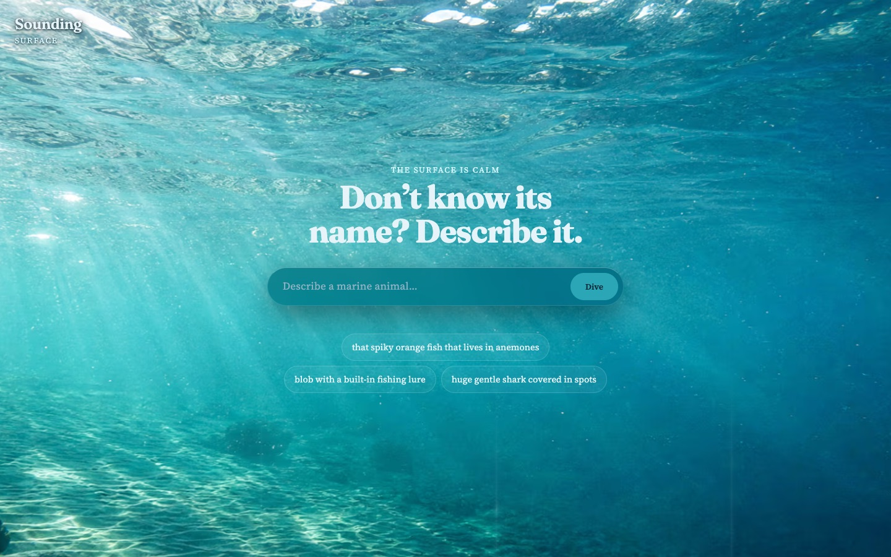

# Sounding

Describe a sea creature in your own words, however vague or misspelled, and dive down to find it: a real photo and description, pulled from iNaturalist.

## [▶ Live Demo](https://sounding-two.vercel.app/)



## The problem

You saw something at the aquarium or on a dive: "that blob with a built-in fishing lure." You don't know its name, so you can't search for it. Most species lookups need the name first, and plain keyword matching is easy to fool: search "seal" and you can end up with a flowering plant called "goldenseal."

Sounding starts from the description. Claude guesses a handful of likely species, the World Register of Marine Species (WoRMS) confirms which of those names are real marine animals, and only a confirmed name is sent to iNaturalist. Claude never makes the final call, and a wrong guess just drops off the list. If nothing matches, you get "no match" instead of a made-up species.

## Highlights

- **Plain-language search:** vague, casual, or misspelled descriptions all work.
- **Three-stage identification:** Claude proposes up to 5 candidates, WoRMS checks them (fixing misspellings and outdated names, dropping anything that doesn't live in the sea), and iNaturalist supplies the photo and description. If none of the scientific names match, the common names go through GBIF instead.
- **Each find takes you deeper:** the water darkens through five depth zones as you search. A WebGL shader draws the caustics and light rays, and a particle layer shifts from bubbles near the surface to marine snow deep down.
- **Scroll back through your dive:** every find gets its own full-screen slide, and a depth gauge lets you jump back to any of them.
- **Accessible:** respects reduced-motion settings, announces results to screen readers, and works with just a keyboard.
- **Light on outside services:** the only API key is the server-side Anthropic key. Requests are capped at 200 characters to keep costs down, and calls to iNaturalist run one at a time to stay within its rate guidance.

## Tech stack

- **Frontend:** vanilla HTML, CSS, and JavaScript. No framework and no build step.
- **Animation:** [GSAP](https://gsap.com) and a custom fragment shader using [OGL](https://github.com/oframe/ogl)
- **AI:** Claude Haiku 4.5 through the Anthropic API, returning structured JSON
- **Data:** [WoRMS](https://www.marinespecies.org), [iNaturalist](https://www.inaturalist.org), and [GBIF](https://www.gbif.org)
- **Hosting:** [Vercel](https://vercel.com) (static site plus one serverless function)

## Run locally

Requires Node 20.6 or newer (for `--env-file`).

```sh
echo "ANTHROPIC_API_KEY=sk-ant-..." > .env.local
npm run dev      # http://localhost:3000
npm test
```
